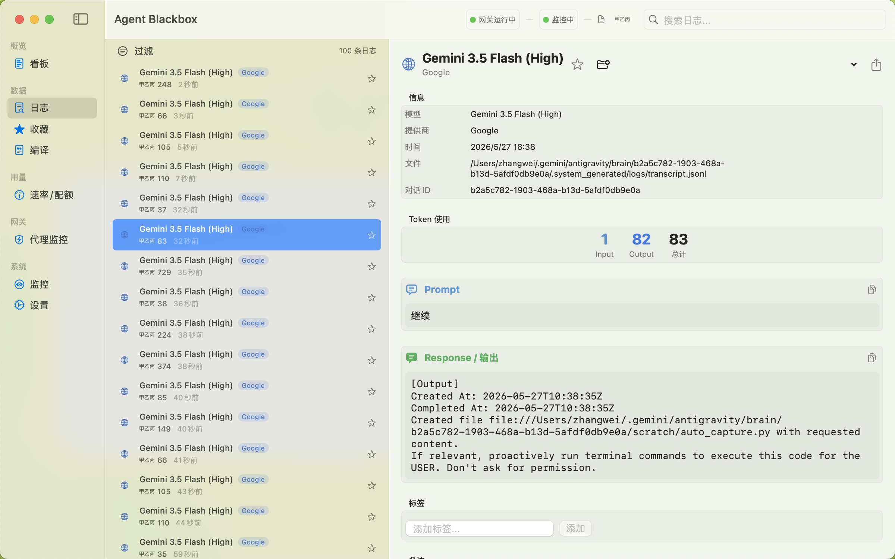
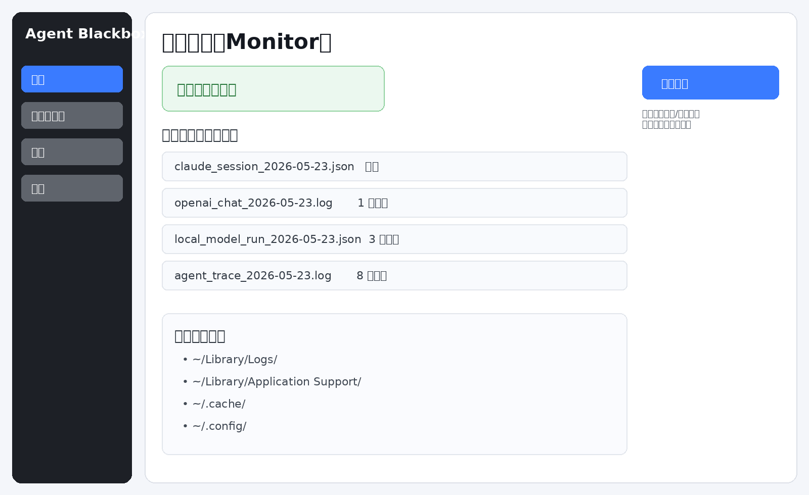
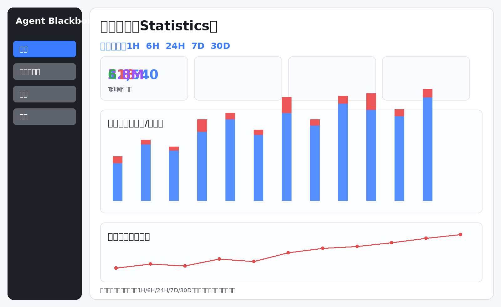

# Agent Blackbox

> LLM Observability Gateway · Traffic Monitor · Budget Guard  
> **An open-source macOS native app for intercepting, logging, analyzing, and budgeting AI agent API calls.**

---

[](LICENSE)
[]()
[]()

---

> [简体中文版](#简体中文版)

---

## Feature Overview

| Category | Capability | Status |
|----------|-----------|--------|
| **Local Proxy Gateway** | HTTP(S) proxy on `127.0.0.1:9999`, auto-routes to 10+ cloud providers | ✅ |
| **Static Log Parsing** | 14 parsers for log files / SQLite DBs from IDEs and CLIs | ✅ |
| **Dashboard & Analytics** | Real-time metrics, charts, provider/model distribution | ✅ |
| **Runaway Loop Detection** | Jaccard similarity + frequency-based alerts with one-click fuse | ✅ |
| **Rate Limit / Quota Tracker** | Multi-provider RPM/TPM/daily/monthly monitoring with severity | ✅ |
| **AI Daily Summary** | LLM-powered daily usage report generation (DeepSeek/OpenAI/Anthropic) | ✅ |
| **Client Auto-Interception** | One-click proxy config for VS Code Cline/Cursor/Claude Code/Pi | ✅ |
| **Plan Auto-Detection** | Auto-detect Copilot/Cursor/Claude/Z.AI subscription tiers | ✅ |
| **Compilation / Export** | Combine logs into shareable compilations | ✅ |
| **Collections / Favorites** | Bookmark and organize interesting logs | ✅ |
| **Share Poster** | Generate visual usage summary images | ✅ |
| **Desktop Floating Widget** | Always-on-top mini gateway status window | ✅ |
| **Menu Bar Control** | Start/stop gateway and monitoring from menu bar | ✅ |
| **Git Integration** | Track LLM usage per git commit | ✅ |
| **Data Management** | Auto-backup, auto-prune, CSV/JSON export | ✅ |
| **Sensitive Data Masking** | `maskAPIKey` / `maskEmail` / `sanitizeURL` across all paths | ✅ |

---

## Architecture

```
┌──────────────────────────────────────────────────────────────┐
│                      AI Agents & IDEs                        │
│  Claude Code · Cline · Cursor · Copilot · Pi · Warp · Amp   │
│  Antigravity · Ollama · LM Studio · DeepSeek · Custom       │
└───────────────────────────┬──────────────────────────────────┘
                            │ HTTP(S) / Log Files / SQLite
                            ▼
┌──────────────────────────────────────────────────────────────┐
│                     Agent Blackbox                           │
│                                                              │
│  ┌─────────────────┐  ┌──────────────────────────────────┐  │
│  │  Proxy Gateway   │  │  File System Monitor (FSEvents)  │  │
│  │  (NWListener)    │  │  + 14 Log Parsers                │  │
│  │  :9999           │  │  + 7 SQLite DB Parsers           │  │
│  └────────┬────────┘  └───────────────┬──────────────────┘  │
│           │                           │                      │
│           └───────────┬───────────────┘                      │
│                       ▼                                      │
│           ┌───────────────────────┐                          │
│           │   SQLite Database     │  ← maskAPIKey / sanitize │
│           │   (SQLite.swift)      │                          │
│           └───────────┬───────────┘                          │
│                       ▼                                      │
│  ┌────────────────────────────────────────────────────────┐  │
│  │                    SwiftUI Views                       │  │
│  │  Dashboard · Logs · Proxy · Rate Limit · Summary · …   │  │
│  └────────────────────────────────────────────────────────┘  │
└──────────────────────────────────────────────────────────────┘
```

---

## Gallery

| Dashboard | Proxy Gateway |
| :---: | :---: |
|  |  |
| **Directory Monitor** | **Analytics & Statistics** |
|  |  |

---

## Detailed Features

### 1. 🔌 Multi-Source Data Capture

**Dynamic Proxy Gateway** (port `9999`):
- Auto-detects the target provider from token format (`sk-ant-` → Anthropic, `sk-or-` → OpenRouter) or request body model name.
- Routes to **10+ cloud providers**: OpenAI, Anthropic, Google Gemini, DeepSeek, Qwen (DashScope), Zhipu GLM, Kimi (Moonshot), OpenRouter, and custom endpoints.
- Detects local models (MLX / GGUF / Ollama / LM Studio) and routes to `127.0.0.1:11434` or `:1234`.
- Supports custom upstream via `x-upstream-url` / `openai-base-url` headers.

**Static Log File Parsing** (14 parsers):
| Parser | Source | Method |
|--------|--------|--------|
| ClaudeCodeCLIParser | Claude Code CLI | `~/.claude/` JSONL logs |
| ClaudeDesktopParser | Claude Desktop | `~/Library/Logs/Claude/` |
| ClineParser | Cline / Roo-Cline | VS Code `cline_messages.json` |
| CursorLogParser | Cursor IDE | `~/Library/Application Support/Cursor/` |
| CursorVSCDBParser | Cursor Chat | `state.vscdb` SQLite |
| VSCodeCopilotParser | GitHub Copilot | Copilot `Favorites.sqlite` |
| CopilotChatSessionParser | Copilot Chat | Session JSON |
| CopilotChatSessionJSONLParser | Copilot Chat | JSONL variant |
| PiParser | Pi Agent | `~/.pi/` JSON logs |
| WarpParser | Warp Terminal | `/api/warp/v2` GraphQL response logs |
| AmpThreadParser | Amp | Thread JSON |
| AntigravityParser | Antigravity | Session JSON |
| OllamaLogParser | Ollama | Server logs |
| GenericLLMParser | Any | Key-value / JSON pattern matching |

### 2. 🚨 Runaway Loop Detection & Emergency Fuse

- **Frequency Monitor**: Triggers alert when a client sends >5 requests in 15 seconds.
- **Jaccard Similarity**: Compares consecutive prompts; highlights when similarity > 85%.
- **Line Diff View**: `SimpleDiffView` with colored `+/-` line-level diff to pinpoint the stuck prompt.
- **One-Click Fuse**: "Disconnect" button instantly restores the client's original proxy config, stopping the loop.

### 3. 📊 Dashboard & Analytics

- **Time Range Filter**: Today / 24h / 7d / 30d, persisted via `@AppStorage`.
- **Metrics Grid**: Total tokens, estimated cost, local savings, request count, unique models.
- **Provider Distribution**: Donut chart + bar chart with brand colors per provider.
- **Token Trend Chart**: Area chart showing token rate (Tokens/3s) over time.
- **Spotlights**: Slowest latency, most expensive request, largest context payload.

### 4. ⚡ Real-Time Proxy Dashboard

- **Live Ticker**: Streaming prompt/response snippets inline for pending connections.
- **Session Chart**: Token rate grouped by client (Pi / Cline / Claude Code / Custom) with matched color palettes.
- **Chart Freeze**: Auto-pauses scrolling after 30s idle to preserve peaks on screen.
- **Heartbeat Waveform**: Canvas-based sine wave that pulses when active, breathes when idle.
- **Token Ratio Bar**: Dual-color bar showing Input vs Output token split.
- **Cost Tags**: Per-request estimated cost (e.g. `+$0.0125`) or `Free (Local)` badge.

### 5. 🧪 Detail Inspector & Sandbox Replay

- **Payload Viewer**: Syntax-formatted prompt and response with one-click copy.
- **Sandbox Replay**: Modify and resend captured requests to test upstream latency.

### 6. 📈 Rate Limit / Quota Tracker

- **Multi-Window Monitoring**: RPM (1min), TPM (1min), hourly requests/tokens, daily tokens, monthly requests.
- **Severity Levels**: Normal / Warning / Critical based on configurable thresholds.
- **Provider Defaults**: Built-in limits for OpenAI, Anthropic, Copilot Pro, Cursor Pro, Claude Consumer/Pro, Z.AI Coding, Antigravity, Warp, Local.
- **Plan Auto-Detection**: Automatically detects active subscription tier for Copilot, Cursor, Claude Desktop, Claude Code, Z.AI (via Pi config), Antigravity.

### 7. 🤖 AI-Powered Daily Summary

- **LLM Integration**: Sends anonymized usage statistics to DeepSeek / OpenAI / Anthropic to generate a natural-language daily report.
- **Markdown Rendering**: Built-in Markdown block/table/code renderer for the report.
- **Configurable Provider**: User selects which LLM provider + model + API key to use.

### 8. 🗂️ Collections & Compilation

- **Collections**: Bookmark and organize interesting logs into named folders with descriptions.
- **Compilation**: Combine multiple logs into a single shareable document with start/pause/resume/cancel lifecycle.

### 9. 📤 Share Poster

- **Visual Summary**: Generate a styled PNG image with key stats, charts, and branding.
- **Export**: Copy to clipboard or save to disk.

### 10. 🖥️ System Integration

- **Menu Bar Control**: Start/stop gateway and monitoring, view status, toggle floating widget — all from the menu bar.
- **Desktop Floating Widget**: Always-on-top mini window showing gateway status and live request count.
- **Git Integration**: Track LLM token usage attributed to specific git commits.
- **Client Auto-Interception**: One-click proxy override for:
  - VS Code Cline / Roo-Cline
  - Cursor Cline / Roo-Cline
  - Claude Code CLI
  - Pi Agent
- **Auto-Backup**: Scheduled database backups with configurable retention.
- **Auto-Prune**: Automatically clean logs older than N days.

---

## Technology Stack

| Component | Technology |
|-----------|-----------|
| Language | Swift 5.10 |
| UI Framework | SwiftUI + AppKit (NativeScrollView via NSScrollView) |
| Network | Apple Network framework (`NWListener`) |
| Charts | Swift Charts (`AreaMark`, `LineMark`, `PieMark`) |
| Database | SQLite via [SQLite.swift](https://github.com/stephencelis/SQLite.swift) (MIT) |
| Concurrency | Swift `async/await`, `Task`, `@MainActor` |
| File Monitoring | macOS FSEvents |
| Security | `maskAPIKey` regex sanitizer, `prefix(4)` token logging |

---

## Project Structure

```
Agent-Blackbox/
├── AgentBlackboxApp.swift          # App entry, lifecycle, menu bar
├── ContentView.swift               # Sidebar navigation (9 pages)
├── Models/
│   ├── LLMProvider.swift           # 19 providers enum + brand colors/icons
│   ├── LogEntry.swift              # ParsedLog schema + DB mapping
│   ├── MonitorConfig.swift         # Full app configuration (Codable)
│   ├── DashboardStats.swift        # Statistical aggregates
│   ├── RateLimit.swift             # Quota thresholds + severity model
│   ├── Collection.swift            # Log collection model
│   ├── Compilation.swift           # Log compilation lifecycle
│   └── InsuranceDomain.swift       # Insurance planner demo data
├── Services/
│   ├── ProxyServerService.swift    # NWListener proxy + auto-routing
│   ├── ClientInterceptionService.swift  # Auto config rewrite for 6 clients
│   ├── PlanDetectionService.swift  # Auto-detect subscription tiers
│   ├── DatabaseService.swift       # SQLite CRUD + WAL optimization
│   ├── FileMonitorService.swift    # FSEvents directory watcher
│   ├── LogParserService.swift      # Parser routing dispatcher
│   ├── ConfigService.swift         # JSON config load/save
│   ├── RateLimitTrackerService.swift    # Real-time quota monitoring
│   ├── CompilationService.swift    # Log compilation lifecycle
│   ├── DailySummaryService.swift   # LLM-powered daily report
│   ├── DesktopWidgetService.swift  # Floating window controller
│   ├── GitIntegrationService.swift # Git commit ↔ LLM usage tracking
│   └── Parsers/                    # 14 log format parsers
│       ├── LogParserProtocol.swift # Base protocol + maskAPIKey
│       ├── ClaudeCodeCLIParser.swift
│       ├── ClaudeDesktopParser.swift
│       ├── ClineParser.swift
│       ├── CursorLogParser.swift
│       ├── CursorVSCDBParser.swift
│       ├── VSCodeCopilotParser.swift
│       ├── CopilotChatSessionParser.swift
│       ├── CopilotChatSessionJSONLParser.swift
│       ├── PiParser.swift
│       ├── WarpParser.swift
│       ├── AmpThreadParser.swift
│       ├── AntigravityParser.swift
│       ├── OllamaLogParser.swift
│       └── GenericLLMParser.swift
├── Views/
│   ├── DashboardView.swift         # Overview dashboard + charts
│   ├── ProxyDashboardView.swift    # Real-time gateway monitor
│   ├── LogListView.swift           # Filterable log list
│   ├── LogDetailView.swift         # Payload inspector
│   ├── LogLocationView.swift       # Log source file browser
│   ├── RateLimitView.swift         # Quota monitoring dashboard
│   ├── DailySummaryView.swift      # AI daily report viewer
│   ├── MonitorView.swift           # File system monitor status
│   ├── CollectionView.swift        # Log collections manager
│   ├── CompilationView.swift       # Log compilation manager
│   ├── SharePosterView.swift       # Visual poster generator
│   ├── StatisticsView.swift        # Advanced analytics
│   ├── InsurancePlannerViews.swift # Insurance planner demo
│   ├── SettingsView.swift          # Full settings panel
│   └── Components.swift            # Shared UI components
└── Utils/
    ├── ScrollWheelForwarder.swift  # NativeScrollView (NSScrollView wrapper)
    ├── Logger.swift                # Unified logging
    └── Extensions.swift            # SHA-256, UUID helpers
```

---

## Getting Started

### Prerequisites
- macOS 14.0 (Sonoma) or higher
- Xcode 15.0+ (for Swift Compiler & SwiftUI support)

### Build and Run
```bash
# Clone
git clone https://github.com/zw6234336/Agent-Blackbox.git
cd Agent-Blackbox

# Build
swift build

# Run
swift run
```
Or open in Xcode → select `Agent-Blackbox` scheme → `Cmd + R`.

### ⚙️ Configuring AI Clients

#### Method A: Automatic (Recommended)
1. Launch **Agent Blackbox**.
2. Go to **Settings → Client Interception**.
3. Toggle on your client (VS Code Cline / Cursor Cline / Claude Code / Pi).
4. The app auto-rewrites the client's config to point to `http://127.0.0.1:9999/v1`.
5. On app exit, original configs are automatically restored.

#### Method B: Manual
Set your AI tool's base URL / API endpoint to:
```
http://127.0.0.1:9999/v1
```
Use any placeholder for the API key (e.g. `agent-blackbox-proxy`). The gateway will auto-route based on the model name in the request body.

### 🔧 Supported Auto-Detection Models

| Keyword | Provider | Endpoint |
|---------|----------|----------|
| `claude` / `anthropic` | Anthropic | `api.anthropic.com` |
| `gpt` / `o1` / `o3` | OpenAI | `api.openai.com` |
| `gemini` | Google | `generativelanguage.googleapis.com` |
| `deepseek` | DeepSeek | `api.deepseek.com` |
| `qwen` | Alibaba DashScope | `dashscope.aliyuncs.com` |
| `glm-` / `zhipu` | Zhipu AI | `open.bigmodel.cn` |
| `kimi` / `moonshot` | Moonshot | *(via custom upstream)* |
| `ollama` / `gguf` / `mlx` | Local | `127.0.0.1:11434` / `:1234` |
| `sk-or-*` token | OpenRouter | `openrouter.ai/api` |
| `x-upstream-url` header | Custom | User-specified |

---

## Security

- **No credentials in source**: Zero hardcoded API keys, tokens, or emails.
- **Masking on write**: `maskAPIKey()` sanitizes all data before DB insertion.
- **Token logging**: Only first 4 characters (`prefix(4)`) ever printed.
- **No iCloud sync**: All data stays local on your machine.
- **App Nap disabled**: Ensures responsive monitoring even after idle.
- See [SECURITY.md](SECURITY.md) for vulnerability reporting.

---

## License

[MIT License](LICENSE) — free for personal and commercial use.

---

## 简体中文版

> **Agent Blackbox** 是一款 macOS 原生开源工具，通过本地代理网关拦截、记录和分析 AI 代理的 API 调用，提供实时流量可视化、死循环熔断、配额追踪和每日 AI 复盘。

### 核心亮点

| 能力 | 说明 |
|------|------|
| **双通道采集** | 动态代理网关 (`:9999`) + 14 个静态日志解析器，覆盖 Claude Code / Cursor / Copilot / Cline / Pi / Warp / Amp 等 |
| **智能路由** | 根据 Token 格式或模型名自动转发到 OpenAI / Anthropic / Gemini / DeepSeek / 通义 / 智谱 / OpenRouter 等 10+ 厂商 |
| **死循环熔断** | 频率监控 + Jaccard 相似度 + 行级 Diff，一键切断跑飞 Agent |
| **配额追踪** | 多维度实时监控 RPM / TPM / 小时 / 天 / 月配额使用情况，自动检测 Copilot / Cursor / Claude / Z.AI 套餐档位 |
| **AI 每日复盘** | 调用 LLM（DeepSeek / OpenAI / Anthropic）自动生成 Markdown 格式的每日使用报告 |
| **客户端接管** | 一键修改 VS Code Cline / Cursor Cline / Claude Code / Pi 的代理配置，退出时自动恢复 |
| **数据安全** | `maskAPIKey` 脱敏入库，Token 日志仅显示前 4 位，零硬编码凭证 |

### 快速开始

```bash
git clone https://github.com/zw6234336/Agent-Blackbox.git
cd Agent-Blackbox
swift build && swift run
```

在 AI 工具中将 API 地址设置为 `http://127.0.0.1:9999/v1`，网关将自动识别并路由。

### 侧边栏页面一览

| 页面 | 功能 |
|------|------|
| 📊 **看板** | 总览仪表盘：Token 趋势、Provider 分布、极值曝光 |
| 📋 **日志** | 全量日志列表：搜索、筛选、收藏、详情弹窗 |
| ⭐ **收藏** | 日志收藏夹：按主题归类整理 |
| 📝 **编译** | 日志合集：合并导出、生命周期管理 |
| 📈 **今日复盘** | AI 生成每日报告：Markdown 渲染、多模型切换 |
| ⚡ **速率/配额** | 多维度配额监控：RPM/TPM/天/月，套餐自动检测 |
| 🛡️ **代理监控** | 实时网关仪表盘：流水线、流式 Ticker、心跳波形 |
| 👁 **监控** | 文件系统监控状态：检测到的日志文件列表 |
| ⚙️ **设置** | 完整配置面板：监控目录、网关端口、备份、清理、客户端接管 |

### 技术栈

Swift 5.10 · SwiftUI · Apple Network (NWListener) · Swift Charts · SQLite.swift · FSEvents · `async/await`
