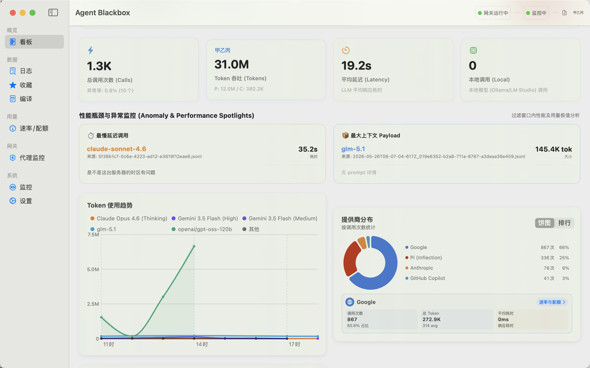

# Agent Blackbox

An LLM Observability Gateway, Traffic Monitor & Budget Guard for Autonomous AI Agents (Cline, Claude Code, Cursor, Pi, etc.) on macOS.

<p align="center">
  
</p>

---

> [简体中文版](#简体中文版)

---

## English Version

**Agent Blackbox** is a native macOS developer tool that intercepts, logs, and analyzes outgoing API calls from autonomous AI agents, coding assistants, and command-line scripts. By operating as a local proxy gateway, it provides real-time transparency, performance auditing, and critical runaway billing protection.

### Core Value Proposition

Autonomous AI agents (such as Cline, Claude Code, and Pi Agent) perform iterative workflows (coding, compiling, testing). If they fail to fix an error, they can fall into a high-frequency **infinite loop**, consuming millions of API tokens and costing hundreds of dollars in minutes. 

Agent Blackbox provides a local gateway sandbox that intercept these loops, estimates costs, visualizes traffic, and gives developers the tools to inspect payloads and enforce emergency limiters.

---

### Key Features

#### 🔌 Native Client Interception (One-Click Handover)
* Supports automatic proxy setting overrides for:
  - **VS Code & Cursor Extensions**: Cline, Roo-Cline.
  - **CLI Tools**: Claude Code (`claude`), Pi Agent (`pi`).
* Provides a quick **Integration Guide** popover to easily route custom Python/Node.js scripts or `cURL` commands (`export HTTPS_PROXY=http://127.0.0.1:9999`).

#### 🚨 Anti-Runaway Loop Guard & Emergency Fuse
* **Loop Detection**: Monitors connection frequency in real-time. If a client triggers $>5$ requests in 15 seconds, a high-priority alarm flashes.
* **Emergency Cutoff**: Features a one-click "Disconnect Interception" button inside the alarm card, immediately restoring the client's default configurations and shutting off further billing.
* **Prompt Similarity Analyzer**: Compares consecutive prompt payloads using Jaccard Similarity and displays a colored line-by-line `+ / -` diff to pinpoint exactly why the agent is repeating itself.

#### 📊 Developer-Centric Dashboard & Time Range Persistence
* **Safety Banner & Controls**: Display real-time loop risk warning and active shield status, along with an emergency gateway toggle button to shut down or start local listening.
* **Persisted Filter Choice**: Defaults time range to "Today", and saves user filter selection using `@AppStorage` to prevent it from resetting during menu switching.
* **Cost & Local Savings Focus**: Puts total estimated API cost and local Ollama route savings ($0.015 per call saved) front-and-center in the primary metrics grid.
* **Vulnerability Spotlights**: Highlights the slowest latency call, the most expensive request, and the largest context payload in the active time window with inline prompt previews and single-click inspect sheets.

#### 📊 Session-Based Performance Charts (Slide Freezing)
* **Visual Graph**: Displays token rate (Tokens/3s) and cost trends (USD) grouped by client with matching color palettes.
* **Freezing on Idle**: If the gateway is idle for more than 30 seconds, the chart automatically pauses scrolling (`⏸ View Frozen`), preserving historical conversation peaks on the screen instead of letting them slide off-screen.
* **Heartbeat Waveform**: Features a high-performance Canvas-based sinus wave that oscillates dynamically when connections are active and breathes slowly when idle.

#### ⚡ Real-time Timeline Waterfall & Live Ticker
* Color-coded request lists linked to the chart series.
* **Live Ticker**: Displays real-time streaming snippets of prompts and response fragments inline for pending connections.
* **Token Ratio Indicator**: A dual-colored bar showing the ratio of Input (Prompt) vs Output (Completion) tokens.
* **Cost Tags**: Shows individual transaction costs (e.g., `+$0.0125`) or local badges (`Free (Local)` for Ollama).

#### 🧪 Detail Inspector & Sandbox Playground
* **Payload Decoders**: Highlights prompt and response payloads with syntax formatting and single-click copy.
* **Sandbox & Replay**: Allows developers to resend and modify captured requests in a sandbox, measuring latency and server response directly.

---

### Technology Stack
* **Core**: Swift 5.10 / SwiftUI
* **Network Interceptor**: Apple Network framework `NWListener` for local socket proxying.
* **Charts**: Swift Charts (`AreaMark`, `LineMark` with gradient fills).
* **Database**: `SQLite.swift` for lightweight local logging and historical usage aggregation. Heavily optimized using Swift `async/await` and background queue offloading to guarantee stutter-free 60fps UI scrolling.

---

### File Structure
```
Agent-Blackbox/
├── Agent-Blackbox/
│   ├── AgentBlackboxApp.swift        # Main App entry and Lifecycle management
│   ├── ContentView.swift             # Sidebar navigation
│   ├── Models/
│   │   ├── LLMProvider.swift         # LLM Brand Color, Icons, and Log paths
│   │   ├── LogEntry.swift            # Database schema mapping
│   │   ├── MonitorConfig.swift       # Decodable local configurations
│   │   └── DashboardStats.swift      # Statistical data holders
│   ├── Services/
│   │   ├── ProxyServerService.swift  # Socket proxy listener, routing, & rewriting
│   │   ├── ClientInterceptionService.swift # Configuration files rewriter
│   │   ├── LogParserService.swift    # Router parser
│   │   └── FileMonitorService.swift  # File system logging observer
│   └── Views/
│       ├── ProxyDashboardView.swift  # Overhauled Gateway Dashboard View
│       ├── DashboardView.swift       # General Analytics Dashboard
│       └── SettingsView.swift        # Monitored directory and toggle configuration
```

---

### Getting Started

#### Prerequisites
* macOS 14.0 or higher.
* Xcode 15.0+ installed (for Swift Compiler & SwiftUI support).

#### Build and Run
To compile and launch the application locally via Command Line:
```bash
# Build the project
swift build

# Run the executable
swift run
```
Or simply open the directory in Xcode, select the `Agent-Blackbox` scheme, and hit `Cmd + R` to build and run.

#### ⚙️ Configuring VS Code / Cursor AI Clients

You can route your VS Code AI extensions through the Agent Blackbox local proxy using two methods:

##### Method A: Automatic Handover (Recommended)
1. Launch **Agent Blackbox**.
2. Go to **Settings** -> **Client Interception** (or use the toggle panel on the right side of the dashboard).
3. Toggle on **VS Code - Cline** or **VS Code - Roo-Cline**.
4. The application will automatically overwrite your local settings file to point the base URL to `http://127.0.0.1:9999/v1` and set a placeholder API key.
5. On exit, Agent Blackbox will automatically restore your original config files.

##### Method B: Manual Configuration
If automatic file access is blocked by macOS Sandbox permissions:
1. Open **VS Code** (or **Cursor**).
2. Open settings for your extension (e.g. **Cline** or **Roo-Cline**).
3. Set the **API Provider** to **OpenAI Compatible**.
4. Configure the **Base URL** to:
   ```
   http://127.0.0.1:9999/v1
   ```
5. Enter any placeholder text for the **API Key** (e.g., `agent-blackbox-proxy`).
6. Set the **Model ID** to your preferred model (e.g., `claude-3-5-sonnet` or `gpt-4o` or `deepseek-chat`). The gateway will automatically intercept the request, extract the model ID, and forward it to the correct upstream endpoint.

---

## 简体中文版

**Agent Blackbox** 是一款原生的 macOS 开发者工具，专门用于拦截、记录和分析自治 AI 代理、编程助手和命令行脚本的 API 外部请求。通过作为本地代理网关运行，它提供了实时的连接透明度、性能审计和关键的**资费防跑飞保护**。

### 核心业务价值

自治 AI 代理（如 Cline、Claude Code 和 Pi Agent）在执行“编写-编译-测试”的循环任务时，一旦遇到无法解决的编译错误，极易陷入高频重复相同的 **死循环**，在数分钟内瞬间烧掉数百万 Token 和数百美元的云端账单。

Agent Blackbox 提供了一个本地网关沙盒，实时捕获此类死循环，进行资费估算，以可视化曲线反映吞吐趋势，并在异常发生时提供“一键熔断”手段保护开发者资金安全。

---

### 核心功能

#### 🔌 原生客户端接管 (一键托管)
* 支持自动修改配置文件以劫持：
  - **VS Code 与 Cursor 插件**：Cline, Roo-Cline。
  - **命令行工具**：Claude Code (`claude`), Pi Agent (`pi`)。
* 顶部集成**配置指引**，为自定义 Python/Node.js 脚本或 `cURL` 命令行提供一键拷贝的 HTTPS 代理变量配置 (`export HTTPS_PROXY=http://127.0.0.1:9999`)。

#### 🚨 死循环防跑飞警报与紧急熔断
* **死循环诊断**：网关实时监控请求频次，当检测到同一客户端在 15 秒内发起 5 次及以上高频请求时，亮起红色高危警报。
* **紧急熔断器**：报警卡片中包含“切断托管”按钮，点击即可瞬间恢复该客户端的默认代理配置，在网关侧掐断 AI 的无限循环以停止扣费。
* **提示词相似度分析**：通过 Jaccard 词袋相似度对比相邻的 Prompt Payload。当相似度 $>85\%$ 时触发高亮，并提供 `SimpleDiffView`，以红/绿、`+/-` 符号直观展示前后 Prompt 的行级差异，秒级揪出死循环元凶。

#### 📊 开发者自研看板与持久化时间选择 (Redesigned Dashboard)
* **安全横幅与紧急开关**：显示死循环高危预警与网关防御罩开启状态，并提供一键紧急启动/关闭本地网关代理的控制按钮。
* **持久化时间过滤**：将时间范围默认值设为“当天”，并采用 `@AppStorage` 进行偏好固定，在侧边栏页面切换时保留选择。
* **资费与本地节省聚焦**：在最显著的指标卡处展示累计花费以及通过 Ollama 等本地路由节省的金额（每次按 0.015 美元估算）。
* **极值与异常曝光 (Spotlights)**：以三栏卡片将过滤时间段内的“最慢延迟请求”、“最高单次计费”以及“最大上下文 Payload”直接提取展示，支持点击一键弹窗查看 Payload 详情。

#### 📊 会话闲置冷冻图表 (Visual Chart) —— 消除数据空白焦虑
* **性能曲线**：以不同客户端的主题色（如 Pi-粉色、Cline-橙色）分类展示 Token 吞吐率 (T/3s) 或资费消耗 (USD) 曲线。
* **会话冷冻模式**：如果网关检测到 30 秒内没有任何新请求，时间轴将自动停止向左滚动（进入 `⏸ 视图静止` 状态），完整保留上一次的波动波峰。当新请求到来时图表自动唤醒并继续推进，完美解决闲置时数据清空变平的痛点。
* **示波波形**：顶部增加由 Canvas 渲染的正弦呼吸波形，当流式连接活动时波形快速振幅跳动，闲置时变为舒缓低幅的线条，大幅增强界面的“活体感”。

#### ⚡ 实时连接 timeline 与流式 Ticker
* 与图表色系完美对应、一目了然的流水列表。
* **流式 Answer Ticker**：在请求处于 `isPending`（流式输出中）时，列表行直接以跑马灯文本展示 AI 正在吐出的最新文字片段。
* **Token 比率分配条**：精细的双色微型条，展示 Prompt (蓝) 与 Completion (紫) 占比。
* **扣费标签**：明码标价，显示此条请求的预估美分（本地 Ollama 显示为 `本地免费` 绿色徽章）。

#### 🧪 详情解析器与沙盒重放
* **载荷解析**：对解码出的 Prompt 和 Response 进行规范排版，支持一键复制代码。
* **沙盒重放 (Sandbox & Replay)**：支持在本地沙盒中直接修改并“重新发送”捕获到的请求，方便开发人员直接测试代理网关的转发可用性及上游响应延迟。

---

### 技术栈
* **核心框架**：Swift 5.10 / SwiftUI
* **网关拦截**：基于 Network 框架 `NWListener` 实现高并发的本地 TCP/HTTP 套接字代理。
* **图表库**：Swift Charts (采用 `.linearGradient` 渐变填充 AreaMark 与 LineMark)。
* **数据存储**：`SQLite.swift` 驱动的本地轻量级数据库，用于日志持久化及资费分析聚合。经 `async/await` 与后台队列异步化重构，确保在大体量数据库下界面滑动流畅无卡顿。

---

### 快速使用与配置

#### ⚙️ 在 VS Code / Cursor 中配置代理

您可以通过以下两种方式将 VS Code 中的 AI 插件流量接入到 Agent Blackbox：

##### 方法一：自动一键托管（推荐）
1. 启动 **Agent Blackbox** 客户端。
2. 进入 **设置 (Settings)** -> **客户端接管 (Client Interception)** 面板（或者直接使用 Dashboard 右侧的“快捷接管控制”面板）。
3. 开启 **VS Code - Cline** 或 **VS Code - Roo-Cline** 开关。
4. 本应用将自动修改目标插件的配置文件，将 API 提供商重定向至本地网关 `http://127.0.0.1:9999/v1`。
5. 当您退出 Agent Blackbox 时，程序会自动恢复您原本的配置文件备份，实现完全无感接入。

##### 方法二：手动修改配置 (备用)
如果由于 macOS 系统沙盒（Sandbox）或文件读写权限受限导致自动修改失败：
1. 打开 **VS Code** (或 **Cursor**)。
2. 打开 **Cline** 或 **Roo-Cline** 的设置页面。
3. 将 **API Provider**（API 提供商）切换为 **OpenAI Compatible** (或 OpenRouter)。
4. 将 **Base URL** 设置为本地网关地址：
   ```
   http://127.0.0.1:9999/v1
   ```
5. **API Key** 处填写任意占位符（如 `agent-blackbox-proxy`）。
6. **Model ID**（模型名称）处填写您需要调用的真实模型（例如 `claude-3-5-sonnet`、`gpt-4o` 或 `deepseek-chat`）。网关接收到请求后，会自动智能解析并选择正确的云端 API 上游进行路由转发。
