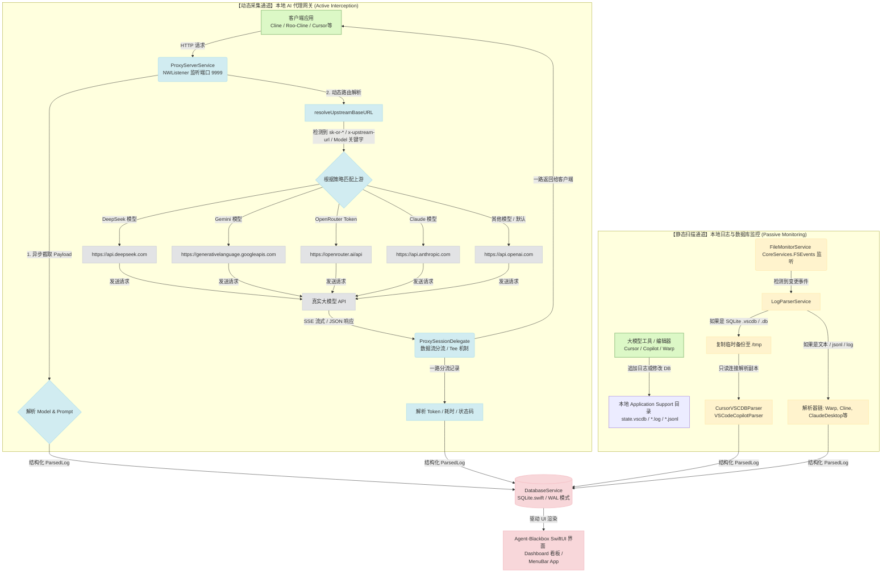

# Agent-Blackbox 数据流向图 (Data Flow)

本项目 `Agent-Blackbox` 是一个轻量级、原生的 macOS 状态监控与 LLM 请求统计工具。它采用“双驱采集”机制，一方面通过**本地 AI 代理网关**进行实时的 HTTP 请求拦截，另一方面通过 **FSEvents 静态日志监听器**读取本地编辑器和终端的聊天历史。

以下是该项目的核心数据流向图：

---

## 数据流详解

### 1. 动态采集通道 (本地网关)
* **入口**：在客户端（如 Cline）配置自定义 API 地址为 `http://127.0.0.1:9999/v1`。
* **分流拦截**：[ProxyServerService](file:///Users/zhangwei/work/github/Agent-Blackbox/Agent-Blackbox/Services/ProxyServerService.swift) 利用底层套接字监听端口，截获 HTTP 流量。
* **智能分发**：根据授权 Token 格式（OpenRouter）、请求头（如 `X-Upstream-Url`）或具体的模型名称（DeepSeek、Gemini）动态分发到真实的厂商端点。
* **流式拦截**：采用 Tee 机制将流式响应分流。主数据流以 Chunked 传输原封不动退回给客户端以保证极低延迟；旁路数据流收集完整的 Completion 并更新 Token 统计数据。

### 2. 静态采集通道 (日志/DB 监听)
* **入口**：[FileMonitorService](file:///Users/zhangwei/work/github/Agent-Blackbox/Agent-Blackbox/Services/FileMonitorService.swift) 启动对 Cursor、VS Code、Claude Desktop 等工具默认存储路径的监控。
* **防锁死安全读取**：当监听到 Cursor 内部的 `state.vscdb` 修改事件后，服务会将数据库及 WAL 文件完整拷贝至 `/tmp` 目录中，在隔离的临时副本上只读运行解析逻辑（[CursorVSCDBParser](file:///Users/zhangwei/work/github/Agent-Blackbox/Agent-Blackbox/Services/Parsers/CursorVSCDBParser.swift)），以避免任何导致主编辑器锁死的风险。
* **流式日志追加**：针对 `*.log` 或 `*.jsonl`，增量分析文件尾部最新的日志记录并提炼成调用日志。

### 3. 数据落库与 UI 联动
* 解析结果最终通过 [DatabaseService](file:///Users/zhangwei/work/github/Agent-Blackbox/Agent-Blackbox/Services/DatabaseService.swift) 存入本地 `metrics.sqlite`。
* 数据库在启动时已配置为 **WAL (Write-Ahead Logging) 模式**，保证高并发日志写入与前端 Dashboard 的高频查询两不冲突，UI 自动响应更新。
