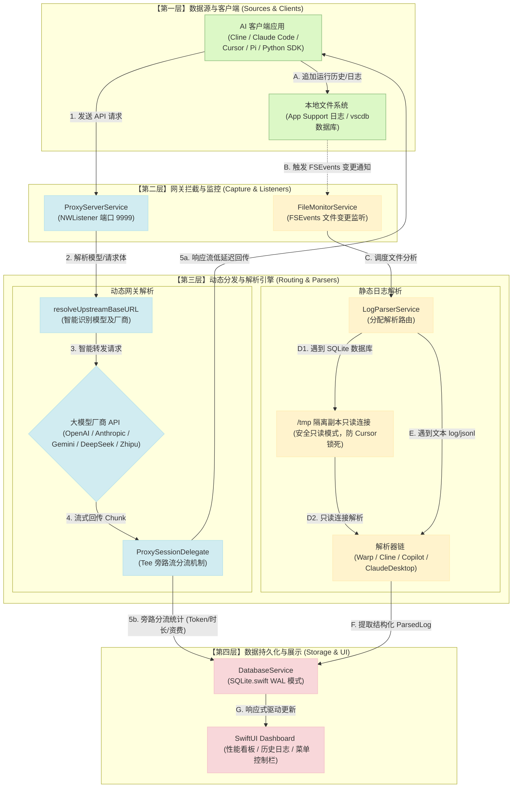

# Agent-Blackbox 数据流向图 (Data Flow)

本项目 `Agent-Blackbox` 是一个轻量级、原生的 macOS 状态监控与 LLM 请求统计工具。它采用**“双驱采集”**机制：
1. **动态采集通道**：通过本地代理网关拦截出网的 HTTP/HTTPS 请求进行分析。
2. **静态扫描通道**：通过 macOS FSEvents 机制监听编辑器和终端日志文件的变更并增量解析。

---

## 核心数据流向图

---

## 数据流详解

### 1. 动态采集通道 (Active Interception)

* **步骤 1：客户端接入**  
  在客户端应用（如 Cline 或 Python 脚本）中，将 Base URL 重定向至本地网关端口 `http://127.0.0.1:9999/v1`。
* **步骤 2 & 3：智能解析与路由**  
  [ProxyServerService](file:///Users/zhangwei/work/github/Agent-Blackbox/Agent-Blackbox/Services/ProxyServerService.swift) 利用底层套接字拦截流量。通过 `resolveUpstreamBaseURL` 方法，根据 Authorization Token 格式（如 OpenRouter）、自定义头部（如 `x-upstream-url`）或请求体模型名称（如 `glm-5.1` / `gemini`）自动完成转发域名的路由重写，将请求安全分发到对应的厂商接口。
* **步骤 4 & 5a：高并发流回传**  
  由于大模型接口广泛采用 SSE 流式输出，网关的 `ProxySessionDelegate` 采用 **Tee (旁路分流) 机制**。在流式传输期间，主数据流以 Chunk 为单位原封不动实时回传给客户端，确保毫秒级的交互延迟不受影响。
* **步骤 5b：旁路吞吐统计**  
  流式生成结束后，旁路通道会统计整个会话消耗的 Prompt Tokens、Completion Tokens 以及 API 响应时长与资费，整理为日志项存入数据库。

### 2. 静态扫描通道 (Passive Monitoring)

* **步骤 A & B：日志事件监听**  
  对于不支持修改 API 地址或自带日志记录的 IDE 工具（如 VS Code Copilot, Warp, Cursor），[FileMonitorService](file:///Users/zhangwei/work/github/Agent-Blackbox/Agent-Blackbox/Services/FileMonitorService.swift) 注册 macOS 的 FSEvents 机制，监听其在 `Application Support` 等系统目录下生成的日志与数据库变更。
* **步骤 C, D1 & D2：防锁死隔离解析**  
  针对 Cursor 产生的数据，其会将聊天记录写入 `state.vscdb` (SQLite)。为了防止与主编辑器争抢文件锁导致 Cursor 卡死崩溃，网关会将数据库拷贝至 `/tmp` 目录建立临时副本，再通过 [LogParserService](file:///Users/zhangwei/work/github/Agent-Blackbox/Agent-Blackbox/Services/LogParserService.swift) 的只读连接进行抓取解析。
* **步骤 E & F：日志增量抽取**  
  针对 `*.log` 或 `*.jsonl` 等流式日志文件，解析器链使用文件指针对尾部增量追加内容进行捕获，将提取的 `ParsedLog` 发送给数据库层。

### 3. 数据落库与 UI 联动 (Persistence & Presentation)

* **步骤 G：WAL SQLite 库与响应式渲染**  
  动态和静态捕获的所有数据最终交由 [DatabaseService](file:///Users/zhangwei/work/github/Agent-Blackbox/Agent-Blackbox/Services/DatabaseService.swift) 进行落库持久化。
* 数据库在初始化时已配置为 **WAL (Write-Ahead Logging) 模式**，保证高并发日志写入与前端 Dashboard 的高频查询两不冲突。落库完成后，网关界面的“实时连接流水”与“今日资费进度计”会自动通过 SwiftUI 响应式绑定进行渲染，呈现流畅的动态流动。
